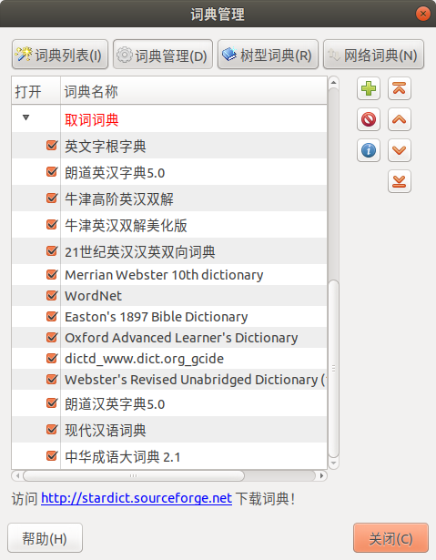

>  http://proxy.grandsoft.com.cn/wpad.dat
>
>  proxy.grandsoft.com.cn:3128
>
>  192.168.0.119:3128

---

>  https://mirrors.tuna.tsinghua.edu.cn/help/ubuntu/
>
>  https://mirrors.tuna.tsinghua.edu.cn/help/pypi/
>
>  pip install pip -U; 
>  pip config set global.index-url https://pypi.tuna.tsinghua.edu.cn/simple

---

>https://blog.csdn.net/u013468614/article/details/103734770
>
>https://blog.csdn.net/cosmoshua/article/details/76644029
>
>vi ~/.bashrc: alias(python pip) PS1(w->W)
>
>pinyin input; sudo dmidecode > hd.txt
>
>NVIDA: Driver CUDA cuDNN TRT

---

> chrome, vscode, baidunetdisk, foxit reader
>
> typora: http://support.typora.io/Typora-on-Linux/
>
> - sudo apt-key adv --keyserver keyserver.ubuntu.com --recv-keys BA300B7755AFCFAE
>   OR: wget -qO - https://typora.io/linux/public-key.asc | sudo apt-key add -
> - sudo add-apt-repository 'deb https://typora.io/linux ./'
>   sudo apt-get update; sudo apt-get install typora
> - wget - c https://typora.io/linux/typora_0.9.96_amd64.deb; 
>   sudo dpkg -i typora_0.9.96_amd64.deb
>
> sudo add-apt-repository ppa:atareao/telegram; 
> sudo apt update && sudo apt install telegram
>
> sudo apt install vim python3-pip git cmake htop net-tools tree pandoc
>
> sudo apt install stardict meld calibre xchm pavucontrol audacity kazam
>
> sudo apt install openssh-server sshfs; sudo service ssh start

---

> sudo pip3 install ipython
> 
> pip3 install torch==1.6.0 torchvision==0.7.0
> 
> pip3 install cython open3d matplotlib pillow labelme
>
> pip3 install opencv-python torchsummary pycuda pycocotools

---

> http://wiki.ros.org/cn/melodic/Installation/Ubuntu
>
> pip3 install catkin_pkg pyyaml empy rospkg

---

> sudo mv * /usr/share/stardict/dic
>
> 

---

**Qv2ray for Ubuntu:**

> https://qv2ray.net/en/getting-started/
>
> https://qv2ray.net/en/getting-started/step1.html#github-releases-binary
>
> https://qv2ray.net/en/getting-started/step2.html#configure-v2ray-core-in-qv2ray
>
> https://qv2ray.net/en/getting-started/step3.html#subscription
>
> https://qv2ray.net/en/plugins/usage.html#how-to-download-and-use-a-plugin
>

> https://github.com/v2fly/v2ray-core/releases
>
> https://github.com/Qv2ray/Qv2ray/releases/latest
>
> https://github.com/Qv2ray/QvPlugin-Trojan/releases
>

1. Download the [AppImage](https://github.com/Qv2ray/Qv2ray/releases/download/v2.6.3/Qv2ray.v2.6.3.linux-x64.AppImage) of Qv2ray, and `chomd +x *.AppImage`
2. Download and unzip [v2ray-core.zip](https://github.com/v2fly/v2ray-core/releases/download/v4.33.0/v2ray-linux-64.zip), then try to `mv` it as `~/.config/qv2ray/vcore`.
3. Run Qv2ray, and click [`Preference`->`Kernel Settings`](https://qv2ray.net/en/getting-started/step2.html#configure-v2ray-core-in-qv2ray), then set `Core Executable Path` and `V2Ray Assets Directory`.
4. Download [Trojan plugin](https://github.com/Qv2ray/QvPlugin-Trojan/releases/download/v2.0.0/QvTrojanPlugin.v2.0.0.linux-x64.so), and click [Plugins->Click Open Local Plugin Folder](https://qv2ray.net/en/plugins/usage.html#how-to-download-and-use-a-plugin), then mv the downloaded `*.so` file to `~/.config/qv2ray/plugins`, then restart Qv2ray.
5. Add hosts: 1. click `New`, paste hosts into `Link`; 2. [add subscription](https://qv2ray.net/en/getting-started/step3.html#subscription): subscribe to [cdp2020](https://raw.githubusercontent.com/cdp2020/v2ray/master/README.md). 

> Fail to update [cdp2020](https://raw.githubusercontent.com/cdp2020/v2ray/master/README.md) : `sudo gedit /etc/hosts`, append a new line of `151.101.84.133 raw.githubusercontent.com`, save and close, update the subscription.
>
> Ref: https://www.ipaddress.com/ https://site.ip138.com/raw.githubusercontent.com/ https://www.cnblogs.com/sinferwu/p/12726833.html

---

> **v2rayN for Win10:** must run `v2rayN.exe` as Administrator.

---

> ssh aic@10.2.53.146
> scp -r xxx aic@10.2.53.146:/home/aic
> sudo sshfs -o allow_other aic@10.2.53.146:/home/aic ~/AIC
>
> scp -r xxx room@10.2.53.149:/home/room
> sudo sshfs -o allow_other room@10.2.53.149:/home/room ~/AI2
>
> scp -r xxx ait@10.1.137.55:/home/ait
> sudo sshfs -o allow_other ait@10.1.137.55:/home/ait ~/AIT
>
> scp -r xxx hua@10.2.55.146:/home/hua
> sudo sshfs -o allow_other hua@10.2.55.146:/home/hua ~/HUA
>
> scp -r xxx hua@10.1.191.83:/home/hua
> sudo sshfs -o allow_other hua@10.1.191.83:/home/hua ~/XavierNX

---

$$
\mathbf{V}_1 \times \mathbf{V}_2 =  \begin{vmatrix} 
\mathbf{i} & \mathbf{j} & \mathbf{k} \\
\frac{\partial X}{\partial u} &  \frac{\partial Y}{\partial u} & 0 \\
\frac{\partial X}{\partial v} &  \frac{\partial Y}{\partial v} & 0 \\
\end{vmatrix}
$$

